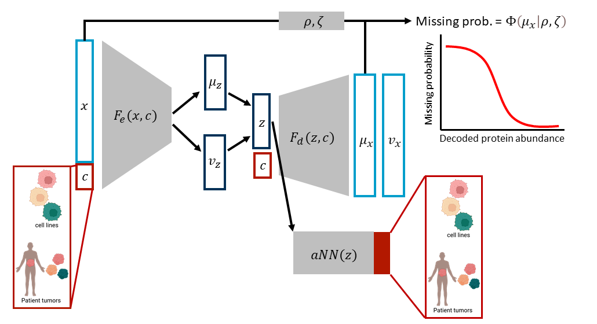

# ProtInt: Integration of proteomics data from cell lines and tumors to profile patient drug sensitivity
ProtInt employs conditional variational autoencoder (cVAE), probabilistic dropout, and adversarial training to integrate proteomics data from cell lines and patient tumors. ProtInt was built with pyTorch 2.11 and was tested under Python 3.11.


## Installing ProtInt
Download this repo, then navigate to this folder and run:
```
pip install -e .
```
## Prepare input data for training
Data from different studies (i.e. batches) must be stored together in one Anndata object with the following properties: 
- Matrix X containing the log-transformed protein intensities. Missing values should be filled (e.g. replaced by 0). The data should have proteins detected in all batches (i.e. no feature missing in an entire batch)
- A layer called `detected`, indicating TRUE if a protein was originally detected, and FALSE if it was missing (and thus the value replaced by the placeholder).
- In the obs, there should be a column called `data_source` indicating the batches. 
## Training protint
Can be done in a terminal. The minimal example is:
```
protint train \
    --train_file your_proteomics_data.h5ad \   # where the data is stored
    --output_dir ../output/directory           # where the model will be exported
```
Alternatively, one can do the training in a Jupyter notebook cell via subprocess. The default parameters, as shown here, were the finalized model used in the manuscript:
```
import subprocess
cmd = [
    "protint", "train",
    "--train_file", "anndata/input/dir/your_proteomics_data.h5ad",
    "--hidden_dims", "128 64",
    "--encoding_dim", "32",
    "--batch_size", "512",
    "--epochs", "3000",
    "--batch_lr", "1e-3",
    "--src_adv_lr", "1e-3",
    "--kl_weight", "1e-6",
    "--dropout_weight", "0.1",
    "--src_adv_weight", "100",
    "--cyc_weight", "0",
    "--output_dir", "/output/directory",
]

result = subprocess.run(cmd, check=False)

```
Training is done with cuda if available, otherwise CPU will be used. To see the full list of input arguments and what they mean:
```
protint train --help
```
## Data projection
After training, one can perform projection, i.e. running the data through the trained model under one data source covariate only:
```
protint projection \
    --projection_file your_proteomics_data.h5ad \
    --model_dir ../output/directory/models \
    --onto "patient_tumor" \    # Has to be one of the entries in data_source
    --output_file ../output/directory/projection.h5ad
```
## Reproducing the analyses in the manuscripts
### Setting up- configuration
The `config.example.yaml` file shows an example of how to set up the directories for storing data, model outputs, and analysis result. One would need to make a `config.local.yaml` file  

### Setting up - conda environments
#### protint
This environment is meant for all analyses except for the celligner integration. Besides the packages as specified in `environment.yml`, installation of MOBER (https://github.com/Novartis/MOBER) as well as some R packages are also necessary:

```
# standard packages
cd envs
conda env create -f environment.yml
conda activate protint
cd ../

# install protint 
pip install -e .

# MOBER installation (in the protint environment)
git clone https://github.com/Novartis/mober.git
cd mober
pip install -e .
cd ../

# R and limma installation (in the protint environment)
conda install -c conda-forge r-base r-essentials rpy2

R
install.packages(c("BiocManager", "msigdbr"))
BiocManager::install(c("limma", "fgsea"))
q()
```
#### Celligner analysis
Another integration method - cellligner (https://github.com/broadinstitute/celligner) was also used for this project. This requires a separate environment with Python 3.9 named `celligner_env`, corresponding to the `environment_celligner.yml` file. The bash script below shows how to set up the celligner environment, along with `mnnpy`. 

```
# install the environment
cd envs
conda env create -f environment_celligner.yml
conda activate celligner_env

# install R and rpy2
conda install -c conda-forge r-base r-essentials rpy2

# install celligner
git clone https://github.com/broadinstitute/celligner.git
git checkout new_dev
cd celligner
pip install --no-deps --no-build-isolation -e .

# install mnnpy
cd mnnpy 
git clone https://github.com/jkobject/mnnpy.git
cd mnpy
pip install .
```


### Data used
The datasets being used are:

- Goncalves et al. (2022) (doi: 10.1016/j.ccell.2022.06.010): Label-free DIA data 949 cancer cell lines, denoted as "ProCan_cell_line". Here I used proteins with at least 2 detected peptides, which amounted to roughly 6200 proteins (lower than their announced 8498 proteins, which included also proteins with only 1 detected peptide)

- Cai et al. (2025) (doi.org/10.1158/2159-8290.CD-24-1488): Label-free DIA data of 1260 tissues from tumor, tumor-free, and healthy tissues (cohort 1). Here we used only tumor tissues (766 samples).

### Performing the analyses and generate the figures
Please refer to the folder `notebooks` in this repo, which contained the Jupyter notebooks for processing the data and running the analyses. Further documentation for the notebooks can be found in this folder.

## Citation
If you use ProtInt in your work, please consider citing our work:

Ta, C. Q., Auth, J. M., Schilling, M., Klingmueller, U., & Raue, A. (2026). Integration of proteomic data from cell lines and tumors. https://doi.org/10.64898/2026.08.11.743858
```
@article {Ta2026.08.11.743858,
	author = {Ta, Cong Quan and Auth, Johannes M and Schilling, Marcel and Klingmueller, Ursula and Raue, Andreas},
	title = {Integration of proteomic data from cell lines and tumors},
	elocation-id = {2026.08.11.743858},
	year = {2026},
	doi = {10.64898/2026.08.11.743858},
	publisher = {Cold Spring Harbor Laboratory},
	URL = {https://www.biorxiv.org/content/early/2026/08/17/2026.08.11.743858},
	eprint = {https://www.biorxiv.org/content/early/2026/08/17/2026.08.11.743858.full.pdf},
	journal = {bioRxiv}
}
```

## License
This project is licensed under the terms of MIT License.
Copyright 2026 Andreas Raue.

## Reference
Slavica Dimitrieva et al. ,Biologically relevant integration of transcriptomics profiles from cancer cell lines, patient-derived xenografts, and clinical tumors using deep learning.Sci. Adv.11,eadn5596(2025).DOI:10.1126/sciadv.adn5596

He, J., Helm, B., Gödtel, F. et al. msBayesImpute as a versatile framework for addressing missing values in biomedical mass spectrometry proteomics data. Commun Chem 9, 236 (2026). https://doi.org/10.1038/s42004-026-02106-3

Hrovatin, K., Moinfar, A., Zappia, L. et al. Integrating single-cell RNA-seq datasets with substantial batch effects. BMC Genomics 26, 974 (2025). https://doi.org/10.1186/s12864-025-12126-3

Webel, H., Niu, L., Nielsen, A.B. et al. Imputation of label-free quantitative mass spectrometry-based proteomics data using self-supervised deep learning. Nat Commun 15, 5405 (2024). https://doi.org/10.1038/s41467-024-48711-5

## Acknowledgement
We thank members of the group of Prof. Andreas Raue for reviewing the code in this repository. Cong Quan Ta thanks Uyen Tho Ta for consultation when designing protint logo.
